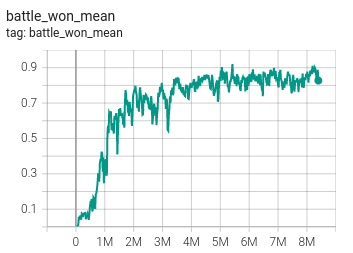
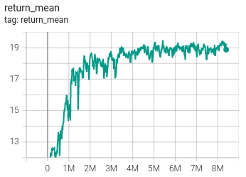
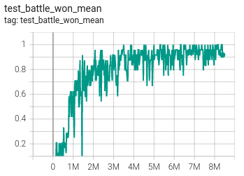
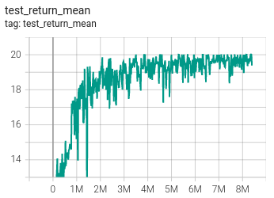

# Graph Attention For Communication in MARL

This is an implementation of Communication in MARL using Graph Neural Network. This is been trained and tested on [StarCraft II](https://github.com/deepmind/pysc2), And this has shown improved training and performance metrics throughout all the maps. I have implemented this on top of [PyMARL](https://github.com/oxwhirl/pymarl) for easier comparative study with respect to other algorithms or implementations like [ePyMARL](https://github.com/uoe-agents/epymarl). 

Currently we have the following algorithms for training.
- [**QMIX**: QMIX: Monotonic Value Function Factorisation for Deep Multi-Agent Reinforcement Learning](https://arxiv.org/abs/1803.11485)
- [**COMA**: Counterfactual Multi-Agent Policy Gradients](https://arxiv.org/abs/1705.08926)
- [**VDN**: Value-Decomposition Networks For Cooperative Multi-Agent Learning](https://arxiv.org/abs/1706.05296) 
- [**IQL**: Independent Q-Learning](https://arxiv.org/abs/1511.08779)
- [**QTRAN**: QTRAN: Learning to Factorize with Transformation for Cooperative Multi-Agent Reinforcement Learning](https://arxiv.org/abs/1905.05408)

For communication we have used to different Architecures

- [**GConv**: Graph Convolutional Network](https://arxiv.org/abs/1609.02907)
- [**GAT**: Graph Attention Network](https://arxiv.org/abs/1710.10903)

### Graph Neural Network.

More Information about the architecture and the execution can be found at [MultiAgent GNN](https://hex-plex.github.io/project/gnn-marl/)
A brief outline would be as follows

<p align="center">

<i>Pipeline for communication using Graph Neural Network</i>
</p>


The implementation is written in PyTorch and uses a modified version of [SMAC](https://github.com/oxwhirl/smac) which could be found in [smac-py](/smac-py/) to include the adjacency matrix as the observation more detail on it can be found [here](#adjacency-matrix).

For a glimpse of the algorithm in action checkout the [**Output**](#output) section

## Installation instructions

I have used the default installation given in PyMARL, along which I have added a few changes to work with the latest version of pytorch (i.e., 1.10.0 at the time of documentation.)  and added the requirements for the [pytorch_geometric]()

```diff
-In the PyMARL repo the version of Cuda and the required version of Pytorch is very old
+The whole codebase is shifted to the latest torch 1.10.0 and cuda 11.3
+Hence custom installation would be better
-Use of the current Docker file is depreciated
```

Build the Dockerfile using 
```shell
cd docker
bash build.sh
```

Set up StarCraft II and SMAC:
```shell
bash install_sc2.sh
```

### Alternatively

After downloading [SC2](https://github.com/deepmind/pysc2#get-starcraft-ii) follow the following steps
```bash
pip install -r requirements.txt
pip install -e smac-py
```

This will download SC2 into the 3rdparty folder and copy the maps necessary to run over.
## Run an experiment 

```shell
python3 src/main.py --config=qmix --env-config=sc2 with env_args.map_name=2s3z
```

The config files act as defaults for an algorithm or environment. 

They are all located in `src/config`.
`--config` refers to the config files in `src/config/algs`
`--env-config` refers to the config files in `src/config/envs`

All results will be stored in the `Results` folder.

The previous config files used for the SMAC Beta have the suffix `_beta`.

## Adjacency Matrix

An adjacency matrix simply represents the vertices of the graph. For the current problem we have used a few heuristics for joining two nodes with a vertex. They are as below
- **Communication distance** : - Even though their is no restriction in communication having local communication improves cooperation in shared tasks
- **Unit Type** : - Many task benefit from similar units perfoming certain part of the task than other other units cooperating with each other.

## Results

Below are the training and test metric of the presented algorithm with **QMIX** on map 2s3z. The study is limited to the number of experiments due to limitation in computation at the disposal. The presented algorithm does support parallel envs and boosting the process of training. This would be tested soon


|Train|--|
|--|--|
|Battle win percentage| Average Return|
|||

|Test|--|
|--|--|
|Battle win percentage| Average Return|
|||

## Output
This is a demo output from the policy whose stats are given above
 